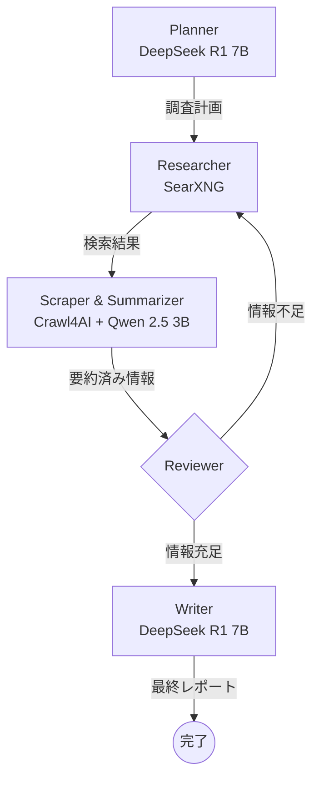

# Local Deep Research

GTX 1660 SUPER（6GB VRAM）環境で動作する自律型Deep Researchエージェント。

LangGraphによるグラフベースのワークフロー、Ollamaによるローカル推論、SearXNGによるプライバシー重視の検索、Crawl4AIによるスクレイピングを組み合わせ、完全にローカルで動作するリサーチシステムを構築する。

## 特徴

- **完全ローカル動作**: クラウドAPIに依存せず、プライバシーを保護
- **低VRAM対応**: 6GB VRAMで動作するよう最適化
- **ハイブリッドモデル戦略**: 推論モデル（DeepSeek R1 7B）と作業モデル（Qwen 2.5 3B）を使い分け
- **自律的な調査**: 検索計画の立案から最終レポート作成まで自動化

## アーキテクチャ



## 必要要件

### ハードウェア
- NVIDIA GPU（6GB VRAM以上）
- 16GB以上のシステムRAM（推奨）

### ソフトウェア
- Docker & Docker Compose
- NVIDIA Container Toolkit
- Python 3.11+

## セットアップ

### 1. リポジトリのクローン

```bash
git clone https://github.com/yaguharu/local-deep-research.git
cd local-deep-research
```

### 2. Docker環境の起動

```bash
docker compose up -d
```

### 3. モデルのダウンロード

```bash
# Plannerモデル
docker exec ollama ollama pull deepseek-r1:7b

# Workerモデル
docker exec ollama ollama pull qwen2.5:3b
```

### 4. Python環境のセットアップ

```bash
# 依存関係のインストール
pip install -r requirements.txt

# または uv を使用
uv sync
```

### 5. 実行

```bash
python src/main.py "調査したいテーマ"
```

## 設定

### Ollama環境変数

以下の環境変数がdocker-compose.yamlで設定されています：

| 変数 | 値 | 説明 |
|------|-----|------|
| `OLLAMA_FLASH_ATTENTION` | `1` | Flash Attentionを有効化しメモリ効率を向上 |
| `OLLAMA_KEEP_ALIVE` | `24h` | モデルをメモリに保持する時間 |

## 使用技術

- [LangGraph](https://github.com/langchain-ai/langgraph) - グラフベースのエージェントフレームワーク
- [Ollama](https://ollama.ai/) - ローカルLLM推論エンジン
- [SearXNG](https://github.com/searxng/searxng) - プライバシー重視のメタ検索エンジン
- [Crawl4AI](https://github.com/unclecode/crawl4ai) - LLM向けWebスクレイピング

## ライセンス

MIT License
