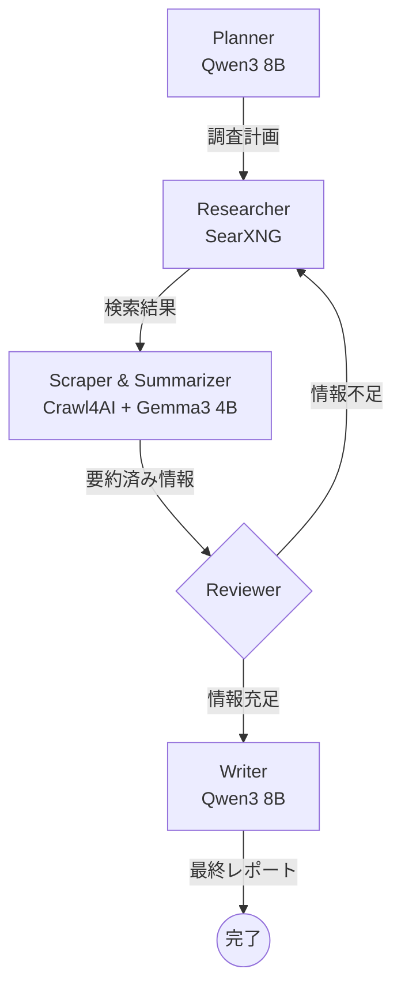

# Local Deep Research

GTX 1660 SUPER（6GB VRAM）環境で動作する自律型Deep Researchエージェント。

LangGraphによるグラフベースのワークフロー、Ollamaによるローカル推論、SearXNGによるプライバシー重視の検索、Crawl4AIによるスクレイピングを組み合わせ、完全にローカルで動作するリサーチシステムを構築する。

## 特徴

- **完全ローカル動作**: クラウドAPIに依存せず、プライバシーを保護
- **低VRAM対応**: 6GB VRAMで動作するよう最適化
- **ハイブリッドモデル戦略**: 推論モデル（Qwen3 8B）と作業モデル（Gemma3 4B）を使い分け
- **自律的な調査**: 検索計画の立案から最終レポート作成まで自動化

## アーキテクチャ


```mermaid
flowchart TD
    A[Planner<br/>Qwen3 8B] -->|調査計画| B[Researcher<br/>SearXNG]
    B -->|検索結果| C[Scraper & Summarizer<br/>Crawl4AI + Gemma3 4B]
    C -->|要約済み情報| D{Reviewer}
    D -->|情報不足| B
    D -->|情報充足| E[Writer<br/>Qwen3 8B]
    E -->|最終レポート| F((完了))
```

## 必要要件

### ハードウェア
- NVIDIA GPU（6GB VRAM以上、GPU推論時）
- 16GB以上のシステムRAM（推奨）

### ソフトウェア
- Docker & Docker Compose
- NVIDIA Container Toolkit（GPU推論時）
- Python 3.13+
- [uv](https://docs.astral.sh/uv/)（推奨）

## セットアップ

### 1. リポジトリのクローン

```bash
git clone https://github.com/haruo2177/local-deep-research.git
cd local-deep-research
```

### 2. Docker環境の起動（初回モデル準備時）

```bash
# CPUモード（デフォルト）
docker compose up -d

# GPUモード（NVIDIA環境）
docker compose -f docker-compose.yaml -f docker-compose.gpu.yaml up -d
```

### 3. モデルのダウンロード

```bash
# Plannerモデル
docker exec ollama ollama pull qwen3:8b

# Workerモデル
docker exec ollama ollama pull gemma3:4b
```

### 4. Python環境のセットアップ

```bash
# uv を使用（推奨）
uv sync

# または pip を使用
pip install -e .
```

### 5. 動作確認

```bash
# Ollamaヘルスチェック
curl http://localhost:11434/api/tags

# SearXNGヘルスチェック
curl http://localhost:8080/healthz

# GPU認識確認（GPUモード時のみ）
docker exec ollama nvidia-smi
```

## 使い方

### Deep Research実行

`src.main` のフル実行モードでは、`ollama` と `searxng` を自動起動し、調査完了後に自動停止します。

```bash
# 基本的な使い方
uv run python -m src.main "調査したいテーマ"

# ファイル出力付き
uv run python -m src.main --output report.md "調査したいテーマ"

# 例
uv run python -m src.main "量子コンピュータの最新動向"
uv run python -m src.main -o quantum_report.md "量子コンピュータの最新動向"
```

### デモモード

個別コンポーネントの動作確認に使用できます：

```bash
# 検索テスト（SearXNG）
uv run python -m src.main --demo search "Python programming"

# スクレイピングテスト（Crawl4AI）
uv run python -m src.main --demo scrape "https://example.com"

# プランナーテスト（検索クエリ生成）
uv run python -m src.main --demo plan "量子コンピュータとは何か"

# 要約テスト（LLM要約）
uv run python -m src.main --demo summarize "要約したいテキスト..."
```

## 設定

### 環境変数

以下の環境変数でカスタマイズが可能です：

| 変数 | デフォルト値 | 説明 |
|------|-------------|------|
| `OLLAMA_URL` | `http://localhost:11434` | OllamaのAPIエンドポイント |
| `SEARXNG_URL` | `http://localhost:8080` | SearXNGのAPIエンドポイント |
| `PLANNER_MODEL` | `qwen3:8b` | 計画に使用するモデル |
| `WORKER_MODEL` | `gemma3:4b` | 要約・評価に使用するモデル |
| `WRITER_MODEL` | `PLANNER_MODEL`と同一 | 執筆に使用するモデル |
| `MAX_CONTEXT_LENGTH` | `4096` | 最大コンテキスト長 |
| `MAX_ITERATIONS` | `5` | 最大調査イテレーション数 |

### Docker環境変数（docker-compose.yaml）

| 変数 | 値 | 説明 |
|------|-----|------|
| `OLLAMA_FLASH_ATTENTION` | `1` | Flash Attentionを有効化しメモリ効率を向上 |
| `OLLAMA_KEEP_ALIVE` | `24h` | モデルをメモリに保持する時間 |

### 設定例

```bash
# 別のモデルを使用する場合
export PLANNER_MODEL="qwen2.5:7b"
export WORKER_MODEL="phi3:mini"

# 執筆に別のモデルを使用する場合（未設定時はPLANNER_MODELと同一）
export WRITER_MODEL="llama3:8b"

# イテレーション数を増やす場合
export MAX_ITERATIONS=10

uv run python -m src.main "調査テーマ"
```

### 動作確認

環境変数が正しく反映されているか確認するには：

```bash
# WRITER_MODEL未設定（PLANNER_MODELにフォールバック）
unset WRITER_MODEL
uv run python -c "from src.config import settings; print(f'writer_model: {settings.writer_model}')"
# 出力: writer_model: qwen3:8b

# WRITER_MODEL設定時
export WRITER_MODEL="llama3:8b"
uv run python -c "from src.config import settings; print(f'writer_model: {settings.writer_model}')"
# 出力: writer_model: llama3:8b
```

## 開発

### テストの実行

```bash
# 全テスト実行
uv run pytest

# カバレッジ付き
uv run pytest --cov=src --cov-report=html

# 特定のテストファイル
uv run pytest tests/test_graph.py
```

### コード品質

```bash
# 型チェック
uv run mypy src/

# リンター
uv run ruff check src/ tests/

# フォーマッター
uv run ruff format src/ tests/
```

## 使用技術

- [LangGraph](https://github.com/langchain-ai/langgraph) - グラフベースのエージェントフレームワーク
- [Ollama](https://ollama.ai/) - ローカルLLM推論エンジン
- [SearXNG](https://github.com/searxng/searxng) - プライバシー重視のメタ検索エンジン
- [Crawl4AI](https://github.com/unclecode/crawl4ai) - LLM向けWebスクレイピング

## 開発状況

| フェーズ | 内容 | 状態 |
|---------|------|------|
| Phase 1-2 | 環境構築・プロジェクト初期化 | ✅ 完了 |
| Phase 3 | コアコンポーネント（config, state, tools, prompts） | ✅ 完了 |
| Phase 4 | LangGraphノード（planner, researcher, scraper, reviewer, writer） | ✅ 完了 |
| Phase 5 | グラフ構築・統合 | ✅ 完了 |
| Phase 6 | 最適化・品質保証 | ✅ 完了 |
| Phase 7 | ドキュメント | ✅ 完了 |

**テスト**: 147テストパス / カバレッジ 95%

## パフォーマンス

GTX 1660 SUPER（6GB VRAM）での計測結果：

- **VRAM使用量**: 3,941 MiB / 6,144 MiB（64%）
- **GPU使用率**: 推論中99%
- **安定性**: 長時間の調査でも安定動作

## ライセンス

MIT License
